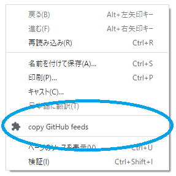

# copy GitHub feeds

## What's this?

This is a browser extension for Edge and Chrome that allows you to copy Github feed links ( release, issues ) from the right-click menu to the clipboard.



## Verified browser versions

|    browser     |     version     |
| -------------- | --------------- |
| Microsoft Edge | `85.0.564.51`   |
| Google Chrome  | `85.0.4183.102` |

## Example

Here's an example of a run on https://github.com/kubernetes/kubernetes.  
The following links can be stored in the clipboard.

```
https://github.com/kubernetes/kubernetes/releases.atom
https://github.com/kubernetes/kubernetes/commits/master.atom
https://rsshub.app/github/issue/kubernetes/kubernetes/open
https://rsshub.app/github/issue/kubernetes/kubernetes/open/good%20first%20issue
```

## Supported feeds

|      feed       |                                  fromat                                  |
| --------------- | ------------------------------------------------------------------------ |
| release         | `https://github.com/{org}/{repo}/releases.atom`                          |
| branch (master) | `https://github.com/{org}/{repo}/commits/master.atom`                    |
| issue (open)    | `https://rsshub.app/github/issue/{org}/{repo}/open`                      |
| issue (label)   | `https://rsshub.app/github/issue/{org}/{repo}/open/good%20first%20issue` |

For more information on rsshub, see https://docs.rsshub.app/en/programming.html#github.

## Usage

#### 1. download extension

```sh
git clone git@github.com:loftkun/copy-github-feeds.git
```

#### 2. open browser extensions page

- chrome://extensions/
- edge://extensions/

#### 3. enable `Developer mode`

You can find `Developer mode` toggle switch in the corner of the extension page.

#### 4. load extension.

Press `Load unpacked extension` buttons to load the extension directory.

the button names  in Japanese below:

- `パッケージ化されていない拡張機能を読み込む` (Chrome)
- `展開して読み込み` (Edge)
